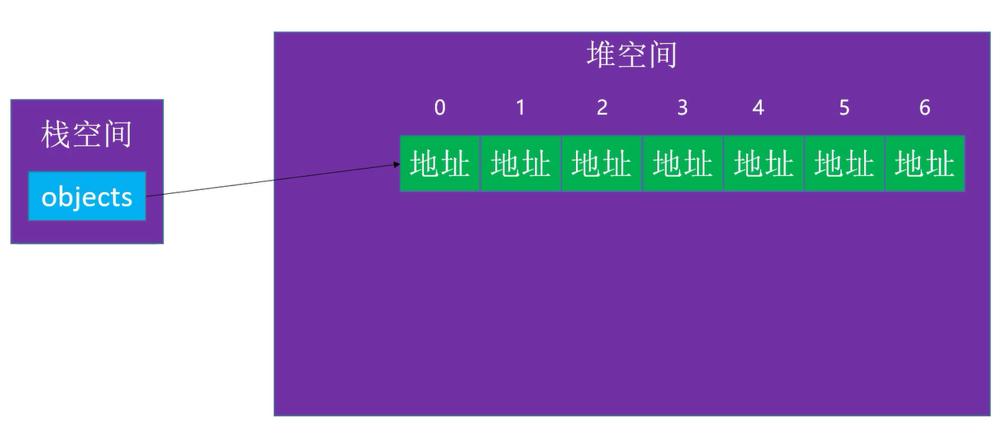
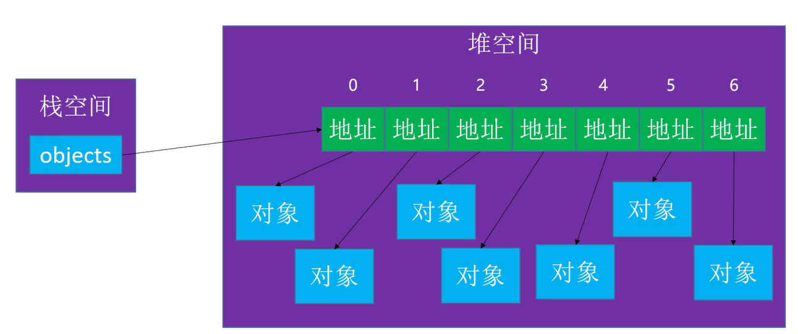

# Java_suanfa
Java算法学习

1. 了解什么事算法复杂度
   举例说明问题
   例子为斐波那契数列的多种实现
2. 自己实现ArrayList
   实现一些基本的接口:
   1. 增加元素(默认在尾部)
   2. 根据指定的下标增加元素
   3. 清空元素
   4. 查询是否存在指定元素
   5. 删除指定下标的元素
   6. 获取元素的数量
   7. 是否为空
   8. 根据下标查找元素
   9. 设置指定下标的值
   10. 找到指定元素在当前列表里面的位置

   启用泛型的时候出现的一些问题:

   以为创建的是Object数组,所以数组里面方的是指向对应元素的地址值,而不是当前传入的值.

   

   

3. 链表

   1. 手写实现LinkedList
